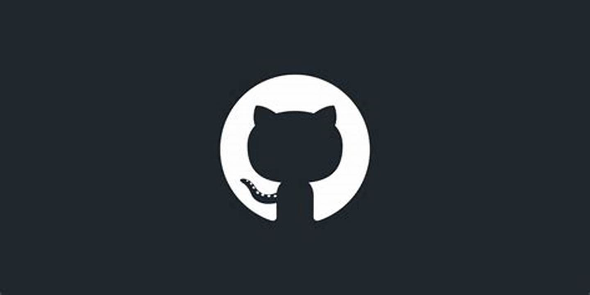
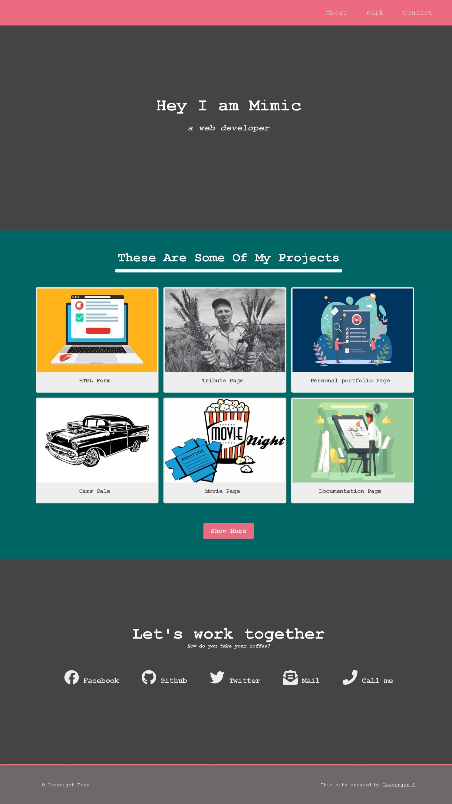

# My Personal Portfolio

Welcome to my personal portfolio repository! This repository contains the code and assets for my personal portfolio website. Here, you'll find a showcase of my skills, projects, and experiences as a developer.

 

## 📷 Screenshots

Below are some screenshots of my personal portfolio website:

1. 

## 📑 Table of Contents

1. [Introduction](#introduction)
2. [Features](#features)
3. [Technologies Used](#technologies-used)
4. [Setup](#setup)
5. [Usage](#usage)
6. [Contributing](#contributing)
7. [License](#license)

## 📝 Introduction

Hello there! I'm excited to share my personal portfolio website with you. This website showcases my skills, projects, and experiences as a developer. Feel free to explore and learn more about me and my work.

## ✨ Features

- **Projects Showcase:** Discover the projects I've worked on, with detailed descriptions and live demos.
- **About Me:** Learn more about me, my background, and my passion for coding.
- **Contact:** Connect with me through various social media channels or via email.
- **Responsive Design:** The portfolio website is fully responsive and works smoothly across different devices.

## 🛠️ Technologies Used

- HTML5, CSS3, and JavaScript for the frontend
- Bootstrap framework for responsive design
- [Insert any other technologies or frameworks you've used]

## ⚙️ Setup

To run this portfolio website locally on your machine, follow these steps:

1. Clone this repository to your local machine.
2. Open the `index.html` file in your preferred web browser.

## 🚀 Usage

Feel free to use this portfolio as a template for creating your own. If you find any bugs or have suggestions for improvements, please open an issue or create a pull request.

## 🤝 Contributing

Contributions are welcome! If you'd like to add features, fix bugs, or improve the existing code, please feel free to contribute. Follow these steps:

1. Fork this repository.
2. Create a new branch with a descriptive name.
3. Make your changes and commit them.
4. Push your changes to your fork.
5. Create a pull request.

## 📄 License

This portfolio is open-source and available under the [MIT License](LICENSE).

## 🌐 Demo

Check out the live demo of my personal portfolio website: [Demo link](https://laavanjan.github.io/Personalpage-1/)

Thank you for visiting my repository and checking out my personal portfolio website! If you have any questions or feedback, feel free to reach out to me.

Happy coding! 🚀
